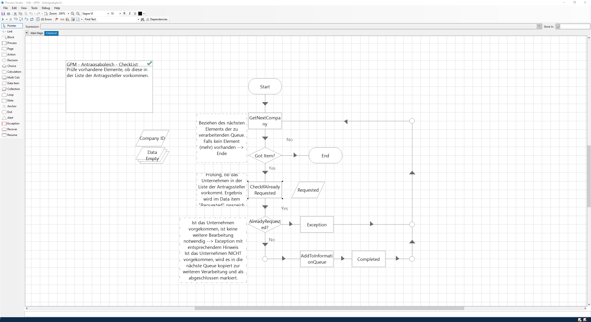
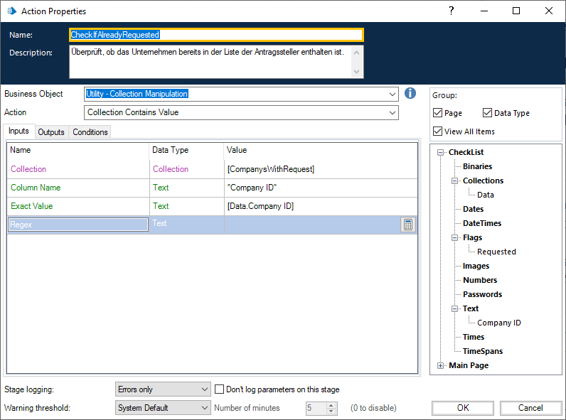
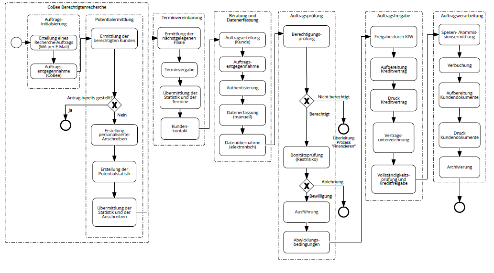

# BluePrismUebung
Repo für den Austausch der exportierten Speicherstände inkl. Dokumentation


# Dependencies
Externe Business Objekte werden unter utils/ bereitgestellt. Quellen:
- https://github.com/blue-prism/pop3-smtp-utility
- https://github.com/blue-prism/file-management-utility
- https://github.com/blue-prism/collection-manipulation
- https://github.com/blue-prism/strings-utility.git

#Dokumentation

## 1	Beschreibung und Problemstellung
Im Rahmen der Veranstaltung „Geschäftsprozessmanagement 2“ stellte die Partnerfirma ComTS eine Automatisierungsaufgabe, um die gelernten theoretischen Inhalte des Moduls zu verfestigen. In dieser Aufgabe sollte eine Gruppe aus ca. fünf Studierenden gemeinsam einen Prozess innerhalb der Software „Blue Prism“ automatisieren, diesen technisch und formal dokumentieren und eine Präsentation vorbereiten.

## 1.1	Case-Beschreibung
Der Case „Recherche zur Ermittlung von Berechtigten für Finanzhilfen“ beschreibt die automatische Suche von potenziellen Unternehmen, welche eine Corona-Hilfe an Anspruch nehmen können, und die Vorbereitung von Informationsbriefen. Für den Prozess wird eine Mail mit einem Anhang bereitgestellt. Im Anhang befindet sich eine CSV-Tabelle, deren Inhalt aus Kombinationen von Branchen und Postleitzahlen bildet. Anhand dieser Postleitzahlen sollen automatisch die entsprechenden Unternehmen aus https://www.dastelefonbuch.de/ herausgesucht und zwischengespeichert werden. Um zu verhindern, dass Unternehmen, die bereits einen Antrag auf Finanzhilfe gestellt haben, erneut angeschrieben werden, wird ein Abgleich der zwischengespeicherten Unternehmen mit einer Liste von Kundendaten abgeglichen. Die bereinigte Liste mit den zu informierenden Unternehmen wird im letzten Schritt weiterverarbeitet, in dem eine Word-Vorlage mit den relevanten Informationen befüllt wird. Diese Dateien werden in einer .zip-Datei an eine festgelegte E-Mail-Adresse gesendet. Damit ist der Prozess abgeschlossen.

## 1.2	Problemstellung
Die wesentlichen Herausforderungen bei der Umsetzung waren die Analyse der Internetseite sowie die Befüllung der Word-Vorlage.

Zur Recherche im Internet war es erforderlich, ein Business Object zu erzeugen und …

Die Generierung der Informationsschreiben erforderte …

## 2	Aufgabenverteilung und Projektorganisation
Das Projekt wurde von den Studierenden selbstständig in drei wesentliche Bestandteile gegliedert: Eingabe, Verarbeitung, Ausgabe. Die Dokumentation des Projektes wurde untereinander in die entsprechenden Kompetenzbereiche aufgeteilt, um die präziseste fachliche Beschreibung zu gewährleisten.

Die Eingabe der Daten, bearbeitet von Felix Brockschnieder und Benedikt Kaiser, umfasste die Tätigkeiten:

-	E-Mail-Empfang
-	Speichern und Auslesen des Anhangs
-	Verarbeitung jeder Zeile der CSV:
-	Aufruf der Internetseite mit entsprechenden Parametern
-	Auslesen der Ergebnisse
-	Weitergabe der einzelnen Ergebnisse in eine Queue
-	Fertigstellen des Eingabeprozesses (Löschen der bearbeiteten E-Mails)
-	Fehlerhandling

Folgende Tätigkeiten sind für die Bearbeitung des Datenabgleichs durch Florian Göhring getätigt worden:

-	Lesen der Elemente aus der Queue
-	Abgleich des Queue-Elements mit der vorgegebenen Collection
-	Auswahl des Elementes, falls es nicht in der Collection vorkommt
-	Erstellung einer neuen Queue für die zu informierenden Unternehmen

Um den identifizierten zu informierenden Unternehmen ein adäquates Anschreiben zu generieren, übernahmen Oleg Chapaykin und Ravel Siirde die Aufgaben der Ausgabe:

-	Lesen der Elemente aus der Queue
-	Eingabe-Algorithmus in der Word-Vorlage
-	Erstellung des Dokumentenarchivs
-	Senden des Archivs an die definierte Mailadresse

Am Ende der individuellen Bearbeitung der Cases wurden die Teilprozesse zusammengefügt, um eine einzelne Ausführung des automatisierten Prozesses zu ermöglichen. 

Die Kommunikation im Projekt fand primär über das Tool „Discord“ statt. Für die Konzepterstellung, Dokumentation von Fragen und Zeichnungen diente „Microsoft OneNote“ als kollaboratives Notizen-Tool.

## 3	Lösungsprozess
Um die vorliegende Lösung zu entwickeln, hat das Team verschiedene Tätigkeiten durchgeführt, um eine effiziente Zusammenarbeit zu erreichen. Im Folgenden werden diese Aufgaben beschrieben.  

### 3.1	Aufgabenteilung
Um parallel an dem Projekt arbeiten zu können, wurden die verschiedenen Bereiche des Prozesses - Eingabe, Verarbeitung, Ausgabe, aufgeteilt auf die Studierenden. Dies ermöglichte eine zeitsparende, parallele Entwicklung. Die Voraussetzung war an der Stelle das gemeinsame Verständnis der Architektur sowie die klare Abgrenzung der durchzuführenden Prozessschritte. Da es zu Beginn einige Fragen bzgl. der Zusammenarbeit gab, wurde die Möglichkeit einer technischen Unterstützung seitens Herrn Hoppe in Anspruch genommen, der die bestehenden Fragen klären und somit die Voraussetzungen der Zusammenarbeit geklärt werden konnte.
Da _BluePrism_ keine Möglichkeiten für das kollaborative Arbeiten an einem Projekt bietet entschieden wir uns für das Anlegen eines _GitHub_-Repositories. In dieses wurden die in _BluePrism_ erstellten Business-Objekte und Prozesse über die Export-Funktion gespeichert. Da BluePrism diese in Textfiles mit XML-ähnlicher Struktur speichert konnten so die Vorteile der Versionsverwaltung genutzt werden und der aktuelle Stand des Projekts war stehts für alle Studierenden verfügbar.

### 3.2	Schnittstellenfestlegung
Um die einzelnen Teilbereiche miteinander zu verbinden, waren zwei Entscheidungen zu treffen:
1. Wie werden die einzelnen Prozess-Abschnitte entwickelt, um sie am Ende einfach und effizient zusammenführen zu können?
2. Welche Daten werden auf welchem Weg zwischen den Prozessschritten miteinander ausgetauscht?
Die technische Hilfestellung von Herrn Hoppe führte auch hier dazu, dass eine effiziente Entscheidung getroffen werden konnte. Die Prozessschritte wurden  in BluePrism als unabhängige Prozesse entwickelt, was es ermöglicht diese später von einem Hauptprozess aus als Unterprozesse aufzurufen. Mit der Entscheidung die zu bearbeitenden Unternehmen über Warteschlangen (Queues) zwischen den Prozessschritten auszutauschen, wurde die unabhängige Entwicklung der Teilbereiche ermöglicht. Im Anschluss konnten die Studierenden mit der Arbeit beginnen und die Bereichslösungen implementieren.
   
### 3.3	Bereichslösungen
Die parallele Entwicklung an Eingabe, Verarbeitung und Ausgabe ist bei dem gesteckten Zeitfenster essenziell für den Erfolg des Projekts. So können die Teammitglieder gleichzeitig an den Lösungen arbeiten. Das gemeinschaftliche Ziel war die unabhängige Entwicklung, um schnellstmöglich eine funktionierendes Minimum Viable Product (MVP) vorliegen zu haben, welches dann im weiteren Verlauf ergänzt und optimiert werden kann.

#### 3.3.1	Eingabe
Der erste Prozessschritt besteht im wesentlichen aus zweit Abschnitten. Zunächst müssen die per E-Mail versendeten Input-Datensätze mit Branche und Postleitzahl (PLZ) entgegen genommen werden und innerhalb BluePrisms als Collection abgelegt werden. Im Anschluss wird für jeden Datensatz das Telefonbuch durchsucht um eine Lister aller zu bearbeitenden Unternehmen und deren Andressen zu erhalten. Diese werden dann für den nächsten Prozessschritt in eine Queue übergeben.

Prozess 
* Input 
    - csv 
    - email

* Output in Queue
  - Struktur des Outputs beschreiben

Lösung (technisch beschrieben)
* Prerequisites / Abhänigkeiten
    - pop3, string, collection, filemngmt, lokaler pfad für csv dateien
* Main prozess
* Email empfangen und auslesen; speichern der Anhänge
* Process Message
    - csv auslesen
    - sicherstellen das plz korrekt
    - iterieren über einträge
* Crawl Telefonbuch
    - Business Objekt
    - Ergebnisse zusammenfügen
* Übergabe der Result collection to Queue
    - generate eindeutige company ID

Resultat
Struktur des Outputs kurz beschreiben 

#### 3.3.2	Verarbeitung
Ziel der Verarbeitung war die korrekte Erkennung der Unternehmen, die bereits einen konkreten Antrag auf Finanzhilfe gestellt haben, um ein erneutes Informationsschreiben zu vermeiden. Dazu wurde festgelegt, dass eine Queue mit den zu untersuchenden Unternehmen im vorhergehenden Sub-Prozess befüllt wird. Die Unternehmen, die benachrichtigt werden sollen, werden wiederum in eine zweite Queue eingefügt.



Da die Aufgabenstellung nicht die Suche nach den Unternehmen mit Antrag umfasste, wurde davon ausgegangen, dass eine entsprechende Collection bereits besteht und diese (ggf.) in den Prozess übergeben wird.
Zunächst wird aus der Queue aller Unternehmen das nächste verfügbare Element herausgenommen. Sollte keines mehr vorhanden sein, endet der Prozess augenblicklich. Falls ein Element gefunden werden konnte, wird eine Überprüfung durchgeführt. Mit dem Utility "Collection Manipulation" (https://github.com/blue-prism/collection-manipulation) war eine Suche der aktuellen 
"Company ID" in der Collection "ComapnysWithRequest" in der Spalte "Company ID" durchgeführt.



Ist das entsprechende Unternehmen gefunden worden, wird das Flag "Requested" auf ```true``` gesetzt. Anschließend wird dieses Flag überprüft. Sollte das Unternehmen gefunden worden sein, wird das Objekt in der Queue mit einer Exception abgeschlossen und das Nächste wird bearbeitet. Andernfalls wird das Element in die Queue "CompanysWithoutRequest" kopiert und in der aktuellen Queue als "Completed" markiert.

Im Ergebnis werden nun die Elemente aus der Queue "PotentialCompanys" nacheinander in der Collection gesucht und bei Nichtexistenz in die nachfolgende Queue "CompanysWithoutRequest" kopiert. Diese Lösung bietet den Vorteil, dass dieser Prozess gesondert auf mehreren Maschinen gestartet werden kann, um die vielen Unternehmen in der Queue parallel zu bearbeiten. Durch das Queue-Handling von BluePrism ist ausgeschlossen, dass bereits bearbeitete unternehmen erneut geprüft werden, da diese entweder als "Completed" oder als "Exception" markiert wurden. Aktuell bearbeitete Elemente sind blockiert und können ebenfalls nicht von einer zweiten Maschine bearbeitet werden. Dies erlaubt eine maximale Parallelisierung und eine extreme Zeitersparnis. Da die überprüften Unternehmen ebenfalls wieder in einer Queue zwischengespeichert werden, ist eine weitere Parallelisierung im Anschluss möglich.   

#### 3.3.3	Ausgabe
Aufgabenstellung

Lösung (technisch beschrieben)

Resultat

### 3.4	Zusammenführung
Die Erstellung des gesamten Prozesses innerhalb einer Arbeitsgruppe erforderte die Erstellung von Subprozessen und die anschließende zusammenführung in einen Gesamtprozess. Die Umsetzung gestaltete sich dabei prinzipiell sehr einfach, da zunächst ein neuer Prozess erstellt und dann die Subprozesse aufgerufen wurden. Lediglich die Ergänzung der Eingabecollection von Unternehmen mit Antrag musste ergänzt werden. Interessanter gestalteten sich hier die Schnittstellen zwischen den Subprozessen. Die Ausgabe des ersten Prozesses musste mit den Eingaben und Abhängigkeiten des zweiten Prozesses übereinstimmen. Gleiches galt auch zwischen dem zweiten und dem dritten Prozess.

### 3.5	Fragen und Probleme
Während des Projektes sind sowohl bei der Vorbereitung als auch bei der Bearbeitung einige Probleme aufgetreten und Fragen aufgekommen, die im Folgenden gesammelt und erläutert werden. Sollte eine Lösung oder Beantwortung vorhanden sein, wird diese jeweils hier mit aufgeführt.

#### 3.5.1 Zusammenarbeit
Blue Prism unterstützt keine gute Zusammenarbeit via einer Versionierungskontrolle wie z.B. Git, da die Dateien, die die Software im Rahmen der Entwicklung erstellt, im System gespeichert und nicht sinnvoll auszuwerten sind. Dadurch entstand die Frage nach der bestmöglichen Zusammenarbeit innerhalb eines Teams mit Blue Prism. Die Lösung hier ist die unabhängige Entwicklung in eigenständigen Prozessen, die am Ende innerhalb eines Master-Prozesses aufgerufen werden.

#### 3.5.2 Company ID
Die Generierung der eindeutigen ID erzeugte die Frage nach dem Zeitpunkt der Erstellung. Der Vorteil der Verwendung der ID war vor allem beim Abgleich zu den Unternehmen, die bereits einen Antrag auf Corona-Hilfe gestellt haben, du erkennen. Statt des Abgleichs zwischen Name, Adresse, PLZ, Ort, musste lediglich eine ID verglichen werden. So fiel die Entscheidung zur Generierung der ID auf die Suche nach dem Unternehmen im Telefonbuch.

#### 3.5.3 Definierung von Schnittstellen
Die unabhängige Arbeit der Teammitglieder in den Teilbereichen erforderte die Übergabe bzw. Bereitstellung von Daten. Bei der Zusammenführung der Teilprozesse wurde bemerkt, dass einige Schnittstellen unzureichend definiert waren, sodass zunächst eine Kompatibilität hergestellt werden musste, um die Prozesse harmonisch in Verbindung zu bringen. 

#### 3.5.4
#### 3.5.5
#### 3.5.6

## 4 Auswirkungen auf den Referenzprozess


### 4.1 Prozessveränderung
Die im Bankmodell enthaltenen Referenzprozesse „Finanzieren“ und „Vertrieb“ stellen zwar weiterhin die Grundlage für den Case „Recherche zur Ermittlung von Berechtigten für Finanzhilfen“ dar, sie müssen allerdings aufgrund Anzahl der potenziellen Berechtigten und der damit notwendigen Automatisierung der einzelnen Prozessschritte in ihren wesentlichen Teilen angepasst werden. Die Corona-Hilfen werden von den Betroffenen in der Regel dringend benötigt, was die Automatisierung auch aus der Kundenperspektive notwendig macht. Durch die Bereitstellung der Finanzierungshilfen durch die KfW sowie die umfangreiche Risikoübernahme durch die KfW wird der Referenzprozess „Finanzieren“ zusätzlich verändert.



Der angepasste Prozess ist in Abbildung 1 „Angepasster Referenzprozess für Corona-Hilfen“ dargestellt. Bereits die Auftragserteilung weicht vom klassischen Finanzierungsprozess ab, denn hier wird der Auftrag nicht durch den Kunden selbst, sondern der zuständige Mitarbeiter der Fachabteilung für Corona-Hilfe innerhalb der Commerzbank beauftragt die als CoBee bezeichnete Robotics-Unterstützung das Potential für Corona-Hilfen im Kundenbestand zu ermitteln. Diese führt den Auftrag durch die Abfrage des bestandsführenden Systems nach Kunden bestimmter Branchen in den definierten Postleitzahlbereichen sowie den Abgleich mit der Liste der bereits gestellten Anträge auf Corona-Hilfe durch. Sofern ein Kunde gefunden wird, der die Voraussetzungen für einen entsprechenden Antrag erfüllen könnte, wird ein personalisiertes Anschreiben erstellt und ein Bericht erzeugt. Beides wird an den zuständigen Mitarbeiter, der den Auftrag ausgelöst hat, übermittelt. Die Automatisierung dieser Prozessschritte ist Fokus der Gruppe I. Um den Prozess jedoch vollends zu modellieren und in den Kontext des Bankmodells integrieren zu können, müssen auch nachfolgende Prozessschritte berücksichtigt werden.

Als nächstes erfolgt die ebenfalls automatisierte Vergabe von Terminen an die zuvor ermittelten Kunden mittels einer weiteren CoBee. Den Kundenkontakt sowie die anschließende Beratung kann aktuell noch nicht automatisiert erfolgen, weswegen ab hier auf die Expertise der Kundenberater in den einzelnen Filialen der Commerzbank zurückgegriffen wird. Darüber hinaus wird vom Kundenberater auch die Berechtigung des Kunden für die Corona-Hilfen geprüft. Sofern die Berechtigung vorliegt, muss je nach geeignetem Unterstützungsprogramm die Bonität des Kunden für das möglicherweise vorliegende Kreditrisiko geprüft werden. Dieser Schritt entfällt, falls die Bereitstellung der Corona-Hilfen als KfW-Schnellkredit 2020 erfolgen kann, denn hier übernimmt die KfW das Kreditausfallrisiko zu 100%. Die Vergabe der Unterstützung muss allerdings durch die KfW in einem weiteren Schritt bestätigt werden, was ebenfalls eine Abweichung vom klassischen Referenzprozess „Finanzieren“ darstellt. Die restlichen Schritte bis zur Beendigung des Prozesses entsprechen hingegen dem ursprünglichen Referenzprozess.

Wie der Abbildung 1 zu entnehmen ist, wurde für die Remodellierung des Referenzprozesses auf die Methode „Aggregation“ zurückgegriffen, indem der Referenzprozesses „Finanzieren“ mit dem Referenzprozess „Vertrieb“ verschmolzen wurde. Dies ist in den durch die Automatisierung veränderten Reihenfolge der einzelnen Prozessschritte ursächlich. Aufgrund der besonderen Art der Finanzierung mittels staatlicher geförderter Programme wurden die einzelnen Elemente in den Prozessschritten „Auftragsprüfung“ und „Auftragsfreigabe“ konkretisiert und verändert. Diese Art der Remodellierung wird in der Literatur als Instanziierung bzw. Spezialisierung bezeichnet.

### 4.2 Wertbeitrag
Durch die Automatisierung der einzelnen Prozessschritte können Personalkosten eingespart werden. Um den monetären Wert der Investition in das entwickelte IT-System zu bewerten, kann entweder das Verfahren „Time Saving Time Salary“, welches den Wert der eingesparten Arbeitszeit der Mitarbeiter betrachtet, oder das hedonistischen Verfahren, welches auf der Verlagerung der freigewordenen Mitarbeiterkapazitäten in Richtung anspruchsvollerer Tätigkeiten beruht, eingesetzt werden. Letzteres erfordert allerdings tiefere Kenntnis der Aufgaben und Potentiale der eingesparten Arbeitskräfte, die uns fehlt, weswegen wir auf das einfachere Verfahren zurückgreifen müssen (vgl. Sassone 1987).

Das „Time Saving Time Salary” Verfahren basiert auf der Prämisse, dass die Personalkosten eines Mitarbeiters dem Wert seiner Arbeit entsprechen. Da die automatisierten Tätigkeiten kein Vorwissen erfordern und kaum Fehlerpotential bergen, könnten sie auch von Zeitarbeitskräften ohne eine fachliche Ausbildung erledigt werden. Diese würde man nur gesondert für die dedizierten Aufgaben einstellen, sodass die Prämisse eingehalten wird. Für die Vereinfachung der Berechnung wird unterstellt, dass die Arbeitskräfte den in 2020 gültigen Mindestlohn von 9,35 EUR pro Stunde vergütet bekommen. Die Lohnnebenkosten werden auf 20% geschätzt. Folglich ist eine eingesparte Stunde 11,22 EUR wert.

Die Ermittlung der eingesparten Arbeitszeit erfolgt nur auf der Grundlage der von Gruppe I automatisierten Aufgaben. Es handelt sich im Wesentlichen um drei Schritte
1.	Recherche im Bestandskundensystem (Telefonbuch)
2.	Abgleich mit der Liste der bereits gestellten Anträge
3.	Erstellung der personalisierten Anschreiben

Jeder der Schritte wurde je 15 Mal von zwei Testpersonen ausgeführt. Die benötigte Zeit wurde mit einer Stoppuhr gemessen und als endgültige Wert der Median der gemessenen Zeiten herangezogen. So beträgt die eingesparte Arbeitszeit für die Recherche 28 Sekunden, für den Abgleich mit der Liste – 52 Sekunden und für die Erstellung des Anschreibens – 13 Sekunden. Insgesamt konnten durch die Automatisierung somit 93 Sekunden pro potenziellen Antragsteller eingesparten werden. Es muss jedoch angemerkt werden, dass die Ausführungsgeschwindigkeit am Ende der Stichprobe deutlich niedriger ausfiel als am Anfang. Dieser Effekt könnte allerdings mit einer zunehmenden Anzahl an Wiederholungen aufgrund der sehr niedrigen Abwechslungslosigkeit der Aufgaben wieder umkehren.

Um die gesamte Zeit, die die Commerzbank für die Ermittlung der potentiellen Berechtigten für die Corona-Hilfen müsste die eingesparte Zeit mit der Anzahl der betroffenen Kunden der Commerzbank multipliziert werden. Leider veröffentlicht die Commerzbank keine Zahlen zu der Anzahl betreuten Firmenkunden. Laut IfM Bonn gab es im Jahr 2018 3,47 Millionen kleine und mittlere Unternehmen (KMU). Die Commerzbank ist zwar die zweitgrößte Bank in Deutschland, jedoch ist der Bankenmarkt in Deutschland stark fragmentiert und die Commerzbank als Großbank nicht auf KMU spezialisiert, weswegen wir höchstens von einem Marktanteil von 2% ausgehen. Somit hätte die Commerzbank 69.400 potenzielle Berechtigte. Wir nehmen ferner an, dass rd. 30% dieser Kunden bereits proaktiv einen Antrag gestellt haben. Somit müssten die automatisierten Tätigkeiten 48.580 Mal wiederholt werden. Folglich werden rd. 1.255 Arbeitsstunden eingespart. Somit beträgt der monetäre Wert der Investition in die erstellte CoBee 14.081,10 EUR.

### 4.3 Strategische Bedeutung

