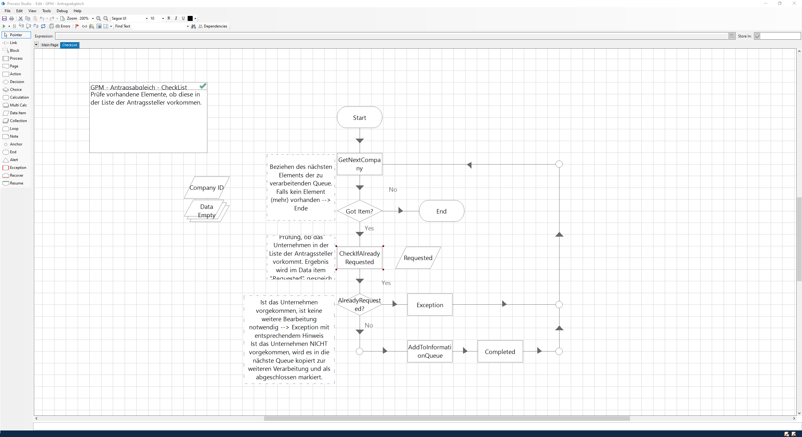
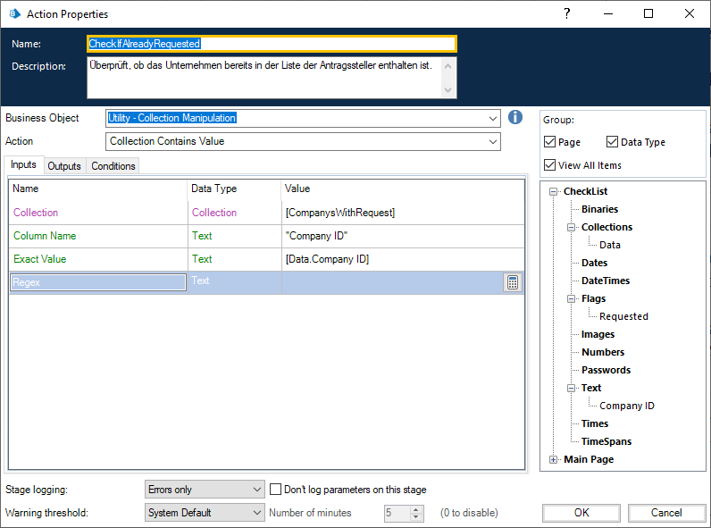

# BluePrismUebung
Repo für den Austausch der exportierten Speicherstände inkl. Dokumentation


# Dependencies
Externe Business Objekte werden unter utils/ bereitgestellt. Quellen:
- https://github.com/blue-prism/pop3-smtp-utility
- https://github.com/blue-prism/file-management-utility
- https://github.com/blue-prism/collection-manipulation
- https://github.com/blue-prism/strings-utility.git

#Dokumentation

## 1	Beschreibung und Problemstellung
Im Rahmen der Veranstaltung „Geschäftsprozessmanagement 2“ stellte die Partnerfirma ComTS eine Automatisierungsaufgabe, um die gelernten theoretischen Inhalte des Moduls zu verfestigen. In dieser Aufgabe sollte eine Gruppe aus ca. fünf Studierenden gemeinsam einen Prozess innerhalb der Software „Blue Prism“ automatisieren, diesen technisch und formal dokumentieren und eine Präsentation vorbereiten.

## 1.1	Case-Beschreibung
Der Case „Recherche zur Ermittlung von Berechtigten für Finanzhilfen“ beschreibt die automatische Suche von potenziellen Unternehmen, welche eine Corona-Hilfe an Anspruch nehmen können, und die Vorbereitung von Informationsbriefen. Für den Prozess wird eine Mail mit einem Anhang bereitgestellt. Im Anhang befindet sich eine CSV-Tabelle, deren Inhalt aus Kombinationen von Branchen und Postleitzahlen bildet. Anhand dieser Postleitzahlen sollen automatisch die entsprechenden Unternehmen aus https://www.dastelefonbuch.de/ herausgesucht und zwischengespeichert werden. Um zu verhindern, dass Unternehmen, die bereits einen Antrag auf Finanzhilfe gestellt haben, erneut angeschrieben werden, wird ein Abgleich der zwischengespeicherten Unternehmen mit einer Liste von Kundendaten abgeglichen. Die bereinigte Liste mit den zu informierenden Unternehmen wird im letzten Schritt weiterverarbeitet, in dem eine Word-Vorlage mit den relevanten Informationen befüllt wird. Diese Dateien werden in einer .zip-Datei an eine festgelegte E-Mail-Adresse gesendet. Damit ist der Prozess abgeschlossen.

## 1.2	Problemstellung
Die wesentlichen Herausforderungen bei der Umsetzung waren die Analyse der Internetseite sowie die Befüllung der Word-Vorlage.

Zur Recherche im Internet war es erforderlich, ein Business Object zu erzeugen und …

Die Generierung der Informationsschreiben erforderte …

## 2	Aufgabenverteilung und Projektorganisation
Das Projekt wurde von den Studierenden selbstständig in drei wesentliche Bestandteile gegliedert: Eingabe, Verarbeitung, Ausgabe. Die Dokumentation des Projektes wurde untereinander in die entsprechenden Kompetenzbereiche aufgeteilt, um die präziseste fachliche Beschreibung zu gewährleisten.

Die Eingabe der Daten, bearbeitet von Felix Brockschnieder und Benedikt Kaiser, umfasste die Tätigkeiten:

-	E-Mail-Empfang
-	Speichern und Auslesen des Anhangs
-	Verarbeitung jeder Zeile der CSV:
-	Aufruf der Internetseite mit entsprechenden Parametern
-	Auslesen der Ergebnisse
-	Weitergabe der einzelnen Ergebnisse in eine Queue
-	Fertigstellen des Eingabeprozesses (Löschen der bearbeiteten E-Mails)
-	Fehlerhandling

Folgende Tätigkeiten sind für die Bearbeitung des Datenabgleichs durch Florian Göhring getätigt worden:

-	Lesen der Elemente aus der Queue
-	Abgleich des Queue-Elements mit der vorgegebenen Collection
-	Auswahl des Elementes, falls es nicht in der Collection vorkommt
-	Erstellung einer neuen Queue für die zu informierenden Unternehmen

Um den identifizierten zu informierenden Unternehmen ein adäquates Anschreiben zu generieren, übernahmen Oleg Chapaykin und Ravel Siirde die Aufgaben der Ausgabe:

-	Lesen der Elemente aus der Queue
-	Eingabe-Algorithmus in der Word-Vorlage
-	Erstellung des Dokumentenarchivs
-	Senden des Archivs an die definierte Mailadresse

Am Ende der individuellen Bearbeitung der Cases wurden die Teilprozesse zusammengefügt, um eine einzelne Ausführung des automatisierten Prozesses zu ermöglichen. 

Die Kommunikation im Projekt fand primär über das Tool „Discord“ statt. Für die Konzepterstellung, Dokumentation von Fragen und Zeichnungen diente „Microsoft OneNote“ als kollaboratives Notizen-Tool.

## 3	Lösungsprozess
Um die vorliegende Lösung zu entwickeln, hat das Team verschiedene Tätigkeiten durchgeführt, um eine effiziente Zusammenarbeit zu erreichen. Im Folgenden werden diese Aufgaben beschrieben.  

### 3.1	Aufgabenteilung
Um parallel an dem Projekt arbeiten zu können, wurden die verschiedenen Bereiche des Prozesses - Eingabe, Verarbeitung, Ausgabe, aufgeteilt auf die Studierenden. Dies ermöglichte eine zeitsparende, parallele Entwicklung. Die Voraussetzung war an der Stelle das gemeinsame Verständnis der Architektur sowie die klare Abgrenzung der durchzuführenden Prozessschritte. Da es zu Beginn einige Fragen bzgl. der Zusammenarbeit gab, wurde die Möglichkeit einer technischen Unterstützung seitens Herrn Hoppe in Anspruch genommen, der die bestehenden Fragen klären und somit die Voraussetzungen der Zusammenarbeit geklärt werden konnte.
Da _BluePrism_ keine Möglichkeiten für das kollaborative Arbeiten an einem Projekt bietet entschieden wir uns für das Anlegen eines _GitHub_-Repositories. In dieses wurden die in _BluePrism_ erstellten Business-Objekte und Prozesse über die Export-Funktion gespeichert. Da BluePrism diese in Textfiles mit XML-ähnlicher Struktur speichert konnten so die Vorteile der Versionsverwaltung genutzt werden und der aktuelle Stand des Projekts war stehts für alle Studierenden verfügbar.

### 3.2	Schnittstellenfestlegung
Um die einzelnen Teilbereiche miteinander zu verbinden, waren zwei Entscheidungen zu treffen:
1. Wie werden die einzelnen Prozess-Abschnitte entwickelt, um sie am Ende einfach und effizient zusammenführen zu können?
2. Welche Daten werden auf welchem Weg zwischen den Prozessschritten miteinander ausgetauscht?
Die technische Hilfestellung von Herrn Hoppe führte auch hier dazu, dass eine effiziente Entscheidung getroffen werden konnte. Die Prozessschritte wurden  in BluePrism als unabhängige Prozesse entwickelt, was es ermöglicht diese später von einem Hauptprozess aus als Unterprozesse aufzurufen. Mit der Entscheidung die zu bearbeitenden Unternehmen über Warteschlangen (Queues) zwischen den Prozessschritten auszutauschen, wurde die unabhängige Entwicklung der Teilbereiche ermöglicht. Im Anschluss konnten die Studierenden mit der Arbeit beginnen und die Bereichslösungen implementieren.
   
### 3.3	Bereichslösungen
Die parallele Entwicklung an Eingabe, Verarbeitung und Ausgabe ist bei dem gesteckten Zeitfenster essenziell für den Erfolg des Projekts. So können die Teammitglieder gleichzeitig an den Lösungen arbeiten. Das gemeinschaftliche Ziel war die unabhängige Entwicklung, um schnellstmöglich eine funktionierendes Minimum Viable Product (MVP) vorliegen zu haben, welches dann im weiteren Verlauf ergänzt und optimiert werden kann.

#### 3.3.1	Eingabe
Der erste Prozessschritt besteht im wesentlichen aus zweit Abschnitten. Zunächst müssen die per E-Mail versendeten Input-Datensätze mit Branche und Postleitzahl (PLZ) entgegen genommen werden und innerhalb BluePrisms als Collection abgelegt werden. Im Anschluss wird für jeden Datensatz das Telefonbuch durchsucht um eine Lister aller zu bearbeitenden Unternehmen und deren Andressen zu erhalten. Diese werden dann für den nächsten Prozessschritt in eine Queue übergeben.

Lösung (technisch beschrieben)

Resultat

#### 3.3.2	Verarbeitung
Ziel der Verarbeitung war die korrekte Erkennung der Unternehmen, die bereits einen konkreten Antrag auf Finanzhilfe gestellt haben, um ein erneutes Informationsschreiben zu vermeiden. Dazu wurde festgelegt, dass eine Queue mit den zu untersuchenden Unternehmen im vorhergehenden Sub-Prozess befüllt wird. Die Unternehmen, die benachrichtigt werden sollen, werden wiederum in eine zweite Queue eingefügt.



Da die Aufgabenstellung nicht die Suche nach den Unternehmen mit Antrag umfasste, wurde davon ausgegangen, dass eine entsprechende Collection bereits besteht und diese (ggf.) in den Prozess übergeben wird.
Zunächst wird aus der Queue aller Unternehmen das nächste verfügbare Element herausgenommen. Sollte keines mehr vorhanden sein, endet der Prozess augenblicklich. Falls ein Element gefunden werden konnte, wird eine Überprüfung durchgeführt. Mit dem Utility "Collection Manipulation" (https://github.com/blue-prism/collection-manipulation) war eine Suche der aktuellen 
"Company ID" in der Collection "ComapnysWithRequest" in der Spalte "Company ID" durchgeführt.



Ist das entsprechende Unternehmen gefunden worden, wird das Flag "Requested" auf ```true``` gesetzt. Anschließend wird dieses Flag überprüft. Sollte das Unternehmen gefunden worden sein, wird das Objekt in der Queue mit einer Exception abgeschlossen und das Nächste wird bearbeitet. Andernfalls wird das Element in die Queue "CompanysWithoutRequest" kopiert und in der aktuellen Queue als "Completed" markiert.

Im Ergebnis werden nun die Elemente aus der Queue "PotentialCompanys" nacheinander in der Collection gesucht und bei Nichtexistenz in die nachfolgende Queue "CompanysWithoutRequest" kopiert. Diese Lösung bietet den Vorteil, dass dieser Prozess gesondert auf mehreren Maschinen gestartet werden kann, um die vielen Unternehmen in der Queue parallel zu bearbeiten. Durch das Queue-Handling von BluePrism ist ausgeschlossen, dass bereits bearbeitete unternehmen erneut geprüft werden, da diese entweder als "Completed" oder als "Exception" markiert wurden. Aktuell bearbeitete Elemente sind blockiert und können ebenfalls nicht von einer zweiten Maschine bearbeitet werden. Dies erlaubt eine maximale Parallelisierung und eine extreme Zeitersparnis. Da die überprüften Unternehmen ebenfalls wieder in einer Queue zwischengespeichert werden, ist eine weitere Parallelisierung im Anschluss möglich.   

#### 3.3.3	Ausgabe
Aufgabenstellung

Lösung (technisch beschrieben)

Resultat

### 3.4	Zusammenführung
Kommt noch...

### 3.5	Fragen und Probleme
Während des Projektes sind sowohl bei der Vorbereitung als auch bei der Bearbeitung einige Probleme aufgetreten und Fragen aufgekommen, die im Folgenden gesammelt und erläutert werden. Sollte eine Lösung oder Beantwortung vorhanden sein, wird diese jeweils hier mit aufgeführt.

#### 3.5.1 Zusammenarbeit
Blue Prism unterstützt keine gute Zusammenarbeit via einer Versionierungskontrolle wie z.B. Git, da die Dateien, die die Software im Rahmen der Entwicklung erstellt, im System gespeichert und nicht sinnvoll auszuwerten sind. Dadurch entstand die Frage nach der bestmöglichen Zusammenarbeit innerhalb eines Teams mit Blue Prism. Die Lösung hier ist die unabhängige Entwicklung in eigenständigen Prozessen, die am Ende innerhalb eines Master-Prozesses aufgerufen werden.

#### 3.5.2 Company ID
#### 3.5.3
#### 3.5.4
#### 3.5.5
#### 3.5.6

## 4 Auswirkungen auf den Referenzprozess
### 4.1 Prozessveränderung

### 4.2 Wertbeitrag
### 4.3 Strategische Bedeutung

